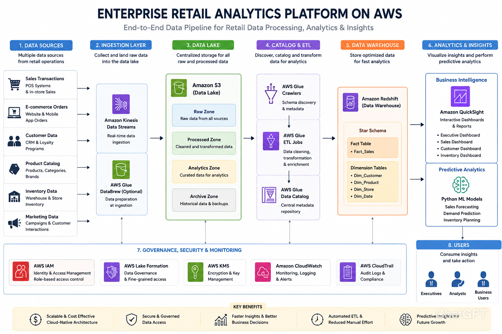

# Enterprise Retail Analytics Platform on AWS

## Overview

This project simulates an enterprise-scale retail analytics platform using AWS cloud services and modern data engineering practices.

The platform ingests retail datasets, processes them through ETL pipelines, stores transformed data in a cloud-based warehouse, and provides business intelligence dashboards and forecasting capabilities.

## Objectives

* Build a cloud-native Data Lake
* Implement automated ETL pipelines
* Design a dimensional Data Warehouse
* Develop BI dashboards
* Perform sales and inventory forecasting

## AWS Services

* Amazon S3
* AWS Glue
* AWS Glue Data Catalog
* Amazon Redshift
* Amazon QuickSight
* AWS IAM
* AWS Lake Formation

## Architecture

## Project Roadmap

* AWS Environment Setup
* Data Lake Creation
* ETL Development
* Data Warehouse Design
* Dashboard Development
* Forecasting Module
* Security Implementation
* Performance Optimization

## Expected Outcomes

* Automated Data Ingestion
* Analytics-Ready Data Warehouse
* Executive Dashboards
* Retail Business Insights
* Demand Forecasting Models
